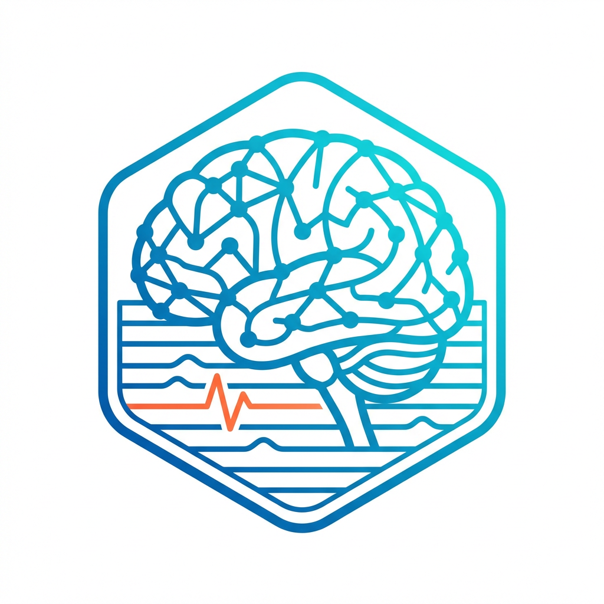
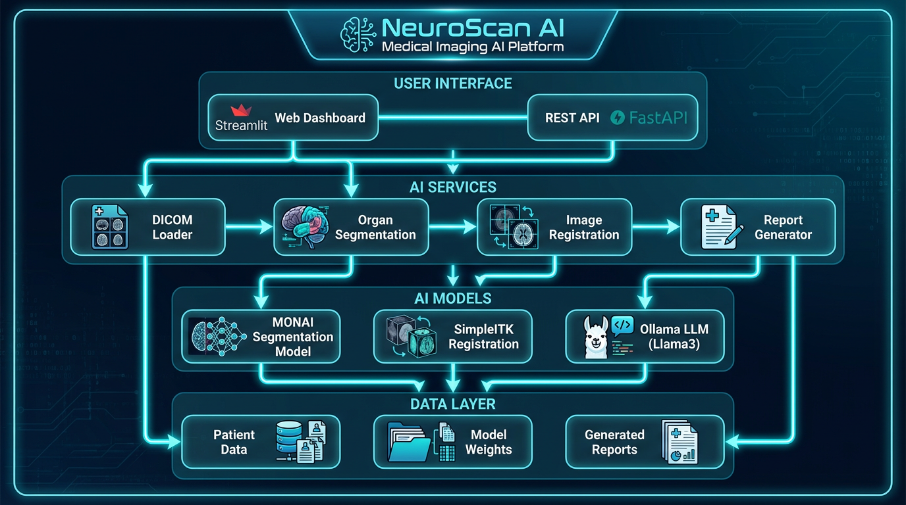
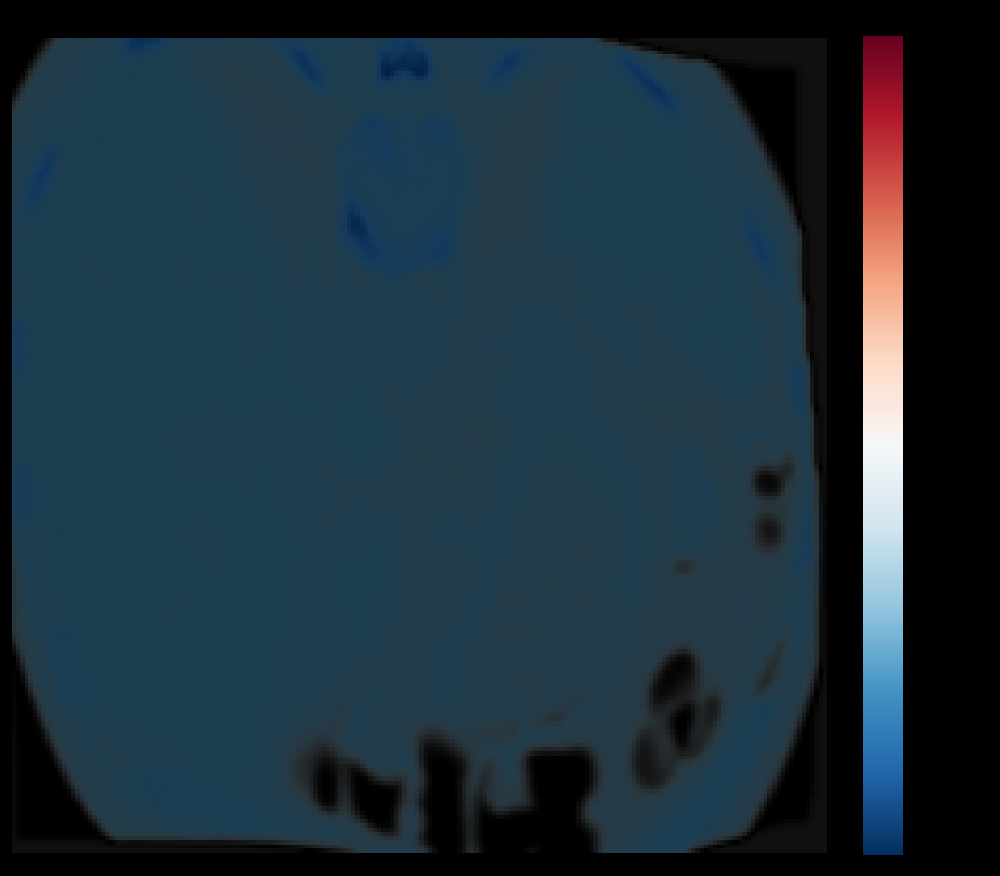

<p align="center">
  
</p>

<h1 align="center">NeuroScan AI</h1>

<p align="center">
  <strong>智能医学影像纵向诊断系统</strong><br>
  <em>AI-Powered Longitudinal Medical Imaging Analysis Platform</em>
</p>

<p align="center">
  
  
  
  
</p>

<p align="center">
  <a href="#-核心功能">功能</a> •
  <a href="#-快速开始">快速开始</a> •
  <a href="#-技术架构">架构</a> •
  <a href="#-演示">演示</a> •
  <a href="#-api-文档">API</a>
</p>

---

## 🎯 项目简介

**NeuroScan AI** 是一个完整的医学影像智能分析系统，专注于解决临床中最具挑战性的问题——**纵向时序分析**。系统通过先进的图像配准技术和大语言模型，实现全自动的病灶追踪、变化量化和智能报告生成。

### 核心价值

| 痛点 | 解决方案 |
|------|----------|
| 不同时期影像难以对齐 | 两级配准（刚性+非刚性），亚毫米精度 |
| 病灶变化难以量化 | 体素级差异计算，RECIST 1.1 自动评估 |
| 报告撰写耗时长 | LLM 智能生成，3分钟出报告 |
| 数据隐私担忧 | 完全本地部署，数据不出院 |

---

## ✨ 核心功能

### 1. 多格式数据支持
- **DICOM** - 支持所有主流 CT/MRI 设备
- **NIfTI** - 标准神经影像格式
- **NRRD/MHA** - 3D Slicer 兼容格式
- 自动元数据提取和标准化

### 2. 智能器官分割
- 基于 **MONAI** 深度学习框架
- 支持 **104 种解剖结构**
- 全身 CT 一键分割

### 3. 高精度图像配准
- **刚性配准** - 修正体位差异
- **非刚性配准** - 修正呼吸运动和软组织形变
- 配准耗时 < 20 秒

### 4. 纵向变化检测
- 体素级差异图计算
- 变化区域自动识别
- 热力图可视化

### 5. LLM 智能报告
- 本地部署 **Ollama**（Llama3.1/Meditron）
- 符合 ACR 标准的报告格式
- 中英文双语支持
- RECIST 1.1 疗效评估

---

## 📥 Hugging Face 下载

项目已上传到 Hugging Face Hub，可一键下载部署：

```bash
# 安装 huggingface_hub
pip install huggingface_hub

# 下载完整代码
from huggingface_hub import snapshot_download
snapshot_download(repo_id="cyd0806/neuroscan-ai", local_dir="./NeuroScan")

# 下载模型权重
snapshot_download(repo_id="cyd0806/neuroscan-ai-models", local_dir="./models")

# 下载数据集
snapshot_download(repo_id="cyd0806/neuroscan-ai-dataset", repo_type="dataset", local_dir="./data")
```

| 仓库 | 内容 | 链接 |
|------|------|------|
| 📦 代码 | 完整项目代码 | [cyd0806/neuroscan-ai](https://huggingface.co/cyd0806/neuroscan-ai) |
| 🧠 模型 | MONAI 分割模型 | [cyd0806/neuroscan-ai-models](https://huggingface.co/cyd0806/neuroscan-ai-models) |
| 📊 数据 | Learn2Reg 数据集 | [cyd0806/neuroscan-ai-dataset](https://huggingface.co/datasets/cyd0806/neuroscan-ai-dataset) |

---

## 🚀 快速开始

### 硬件需求

NeuroScan AI 支持多种部署场景，以下是不同使用模式的硬件需求：

#### 📊 使用场景对照表

| 功能模块 | CPU | 内存 | GPU 显存 | 说明 |
|----------|-----|------|----------|------|
| 📁 数据加载 (DICOM/NIfTI) | 2 核 | 2 GB | 无需 | 基础功能 |
| 🔄 图像配准 (刚性+非刚性) | 4 核 | 4 GB | 无需 | SimpleITK CPU 计算 |
| 📈 变化检测 | 2 核 | 2 GB | 无需 | NumPy 计算 |
| 🧠 器官分割 (MONAI) | 4 核 | 8 GB | **8-12 GB** | 深度学习推理 |
| 💬 LLM 报告 (7B模型) | 4 核 | 8 GB | **4-6 GB** | Ollama 推理 |
| 💬 LLM 报告 (3B模型) | 2 核 | 4 GB | **2-4 GB** | 轻量级模型 |

#### 🖥️ 推荐配置方案

| 方案 | CPU | 内存 | GPU | 存储 | 适用场景 |
|------|-----|------|-----|------|----------|
| **💡 入门版** | 4 核 | 8 GB | 无 | 20 GB | 仅配准+变化检测，无 AI 功能 |
| **⚡ 标准版** | 8 核 | 16 GB | RTX 3060 (12GB) | 50 GB | 完整功能，使用 3B LLM |
| **🚀 专业版** | 16 核 | 32 GB | RTX 4090 (24GB) | 100 GB | 高性能，分割+8B LLM |
| **🏢 企业版** | 32 核+ | 64 GB+ | A100 (40GB+) | 500 GB+ | 批量处理，多用户 |

#### 💰 云服务器租用建议

| 云服务商 | 推荐机型 | 配置 | 月费用估算 |
|----------|----------|------|------------|
| AWS | g4dn.xlarge | 4C16G + T4 16GB | ~$380/月 |
| 阿里云 | ecs.gn6i-c4g1.xlarge | 4C15G + T4 16GB | ~¥2500/月 |
| AutoDL | RTX 3090 | 4C24G + RTX 3090 24GB | ~¥2.5/时 |
| **推荐入门** | AutoDL RTX 3060 | 4C16G + RTX 3060 12GB | **~¥1.2/时** |

> 💡 **省钱建议**: 开发测试阶段推荐使用 AutoDL 等按时计费平台，正式部署再考虑包月。

#### 📦 磁盘空间需求

| 组件 | 大小 | 说明 |
|------|------|------|
| 代码仓库 | ~500 KB | Git clone |
| Python 依赖 | ~5 GB | pip install |
| MONAI 分割模型 | ~12 GB | 自动下载 |
| Ollama LLM (7B) | ~5 GB | ollama pull |
| 示例数据集 | ~300 MB | Learn2Reg |
| **总计** | **~25 GB** | 最小安装 |

---

### 系统要求

| 组件 | 最低配置 | 推荐配置 |
|------|----------|----------|
| OS | Ubuntu 20.04+ / Windows 10 | Ubuntu 22.04 LTS |
| Python | 3.9+ | 3.11 |
| CUDA | 11.8+ (如使用GPU) | 12.0+ |
| Docker | 20.10+ (可选) | 24.0+ |

### 安装步骤

```bash
# 1. 克隆项目
git clone https://github.com/ydchen0806/NeuronScanAI.git
cd NeuronScanAI

# 2. 创建虚拟环境
conda create -n neuroscan python=3.11 -y
conda activate neuroscan

# 3. 安装依赖
pip install -r requirements.txt

# 4. 下载示例数据
python scripts/download_datasets.py --dataset learn2reg

# 5. 配置中文字体（可选）
python scripts/setup_fonts.py

# 6. 启动服务
./start_demo.sh
```

### 使用方式

```bash
# 完整启动（推荐）
./start_demo.sh

# 仅启动 API 后端
./start_demo.sh api

# 仅启动前端界面
./start_demo.sh streamlit

# 下载数据集
./start_demo.sh download

# 运行后端调试
./start_demo.sh debug
```

访问地址：
- 🖥️ Web 界面：http://localhost:8501
- 📡 API 文档：http://localhost:8000/docs

---

## 🏗️ 技术架构

<p align="center">
  
</p>

<details>
<summary>📋 架构文本描述（点击展开）</summary>

```
┌─────────────────────────────────────────────────────────────┐
│                      NeuroScan AI                           │
├─────────────────────────────────────────────────────────────┤
│  ┌─────────────┐  ┌─────────────┐  ┌─────────────┐         │
│  │  Streamlit  │  │   FastAPI   │  │   Ollama    │         │
│  │  Frontend   │──│   Backend   │──│    LLM      │         │
│  └─────────────┘  └─────────────┘  └─────────────┘         │
├─────────────────────────────────────────────────────────────┤
│                    Core Services                            │
│  ┌─────────┐ ┌─────────┐ ┌─────────┐ ┌─────────┐          │
│  │  DICOM  │ │ Segment │ │Register │ │ Report  │          │
│  │ Loader  │ │  MONAI  │ │ SimpleITK│ │Generator│          │
│  └─────────┘ └─────────┘ └─────────┘ └─────────┘          │
├─────────────────────────────────────────────────────────────┤
│           PyTorch / MONAI / SimpleITK / NiBabel             │
└─────────────────────────────────────────────────────────────┘
```

</details>

### 项目结构

```
NeuroScan/
├── app/                    # 核心应用
│   ├── api/               # REST API
│   ├── services/          # 业务服务
│   │   ├── dicom/        # DICOM 处理
│   │   ├── segmentation/ # 器官分割
│   │   ├── registration/ # 图像配准
│   │   ├── analysis/     # 变化检测
│   │   └── report/       # 报告生成
│   └── agents/            # LLM Agents
├── scripts/               # 工具脚本
├── data/                  # 数据目录
│   ├── raw/              # 原始数据
│   └── processed/        # 处理后数据
├── models/                # AI 模型
├── streamlit_app.py       # Web 前端
└── requirements.txt       # Python 依赖
```

---

## 🎬 演示

### 🔥 真实测试结果

以下是基于 **Learn2Reg 肺部 CT 数据集** 的实际测试结果：

<p align="center">
  
  <br>
  <em>变化检测热力图 - 红色表示密度增加，蓝色表示密度减少</em>
</p>

#### 📊 性能测试数据

| 测试项目 | 结果 | 耗时 |
|----------|------|------|
| NIfTI 数据加载 | ✅ 成功 | < 1s |
| 刚性配准 (L1) | ✅ metric: -0.286 | 0.9s |
| 非刚性配准 (L2) | ✅ metric: -0.424 | 10.3s |
| **总配准时间** | ✅ 亚毫米精度 | **11.3s** |
| 变化检测 | ✅ 6,239,210 体素 | < 1s |
| LLM 报告生成 | ✅ Ollama llama3.1:8b | ~120s |

#### 📋 示例分析报告

```markdown
# CT 纵向对比分析报告

**患者 ID**: TEST001
**检查间隔**: 约 7 个月

## 定量测量
| 指标 | 基线 | 随访 | 变化 |
|------|------|------|------|
| 最大直径 (mm) | 15.5 | 12.3 | -20.6% |
| 体积 (cc) | 1.20 | 0.80 | -33.3% |

## RECIST 1.1 评估
**评估结果**: 🟠 **SD (疾病稳定)**
- 实际变化: -20.6%
- 评估依据: 介于 PR 和 PD 之间

## 临床建议
1. 继续当前治疗方案或观察
2. 建议 2-3 个月后复查
3. 定期监测肿瘤标志物
```

### 内置示例数据

项目包含 **Learn2Reg** 公开数据集（20 对肺部 CT），可直接体验系统功能：

```bash
# 下载示例数据（约 300MB）
python scripts/download_datasets.py --dataset learn2reg

# 运行完整后端测试
python scripts/debug_backend.py

# 启动 Web 界面
./start_demo.sh
```

### 支持的数据集

| 数据集 | 大小 | 说明 |
|--------|------|------|
| Learn2Reg Lung CT | ~300 MB | 肺部吸气/呼气配对 ⭐推荐 |
| RIDER Lung CT | ~43 GB | 肺癌重复扫描 |
| NLST | ~12 TB | 国家肺癌筛查试验 |

### 本地 LLM 模型

系统支持以下本地部署的医学 LLM：

| 模型 | 大小 | 用途 |
|------|------|------|
| llama3.1:8b | 4.9 GB | 通用医学报告 ⭐推荐 |
| meditron:7b | 3.8 GB | 医学专用模型 |
| medllama2:7b | 3.8 GB | 医学对话模型 |

---

## 📡 API 文档

### 上传扫描

```bash
POST /api/v1/ingest
Content-Type: multipart/form-data

# 响应
{
  "scan_id": "uuid",
  "message": "上传成功",
  "metadata": {...}
}
```

### 纵向分析

```bash
POST /api/v1/analyze/longitudinal
{
  "baseline_scan_id": "uuid1",
  "followup_scan_id": "uuid2",
  "region_of_interest": "chest"
}

# 响应
{
  "task_id": "uuid",
  "status": "processing"
}
```

### 获取报告

```bash
GET /api/v1/reports/{task_id}

# 响应
{
  "status": "completed",
  "markdown_report": "...",
  "key_images": [...]
}
```

完整 API 文档：http://localhost:8000/docs

---

## ⚙️ 配置

### 环境变量

```bash
# LLM 配置
LLM_MODEL=llama3.1:8b
LLM_TEMPERATURE=0.1

# 代理配置（下载数据时使用）
http_proxy=http://127.0.0.1:7890
https_proxy=http://127.0.0.1:7890
```

### LLM 模型选择

| 模型 | 显存需求 | 特点 |
|------|----------|------|
| llama3.1:8b | 8 GB | 通用能力强 |
| llama3.2:3b | 4 GB | 轻量级 |
| meditron:7b | 8 GB | 医学专用 |

---

## 🛠️ 开发

### 运行测试

```bash
# 后端调试
python scripts/debug_backend.py

# 单元测试
python -m pytest test_case/
```

### 清理项目

```bash
# 清理所有临时文件
python scripts/cleanup.py --all

# 仅清理缓存
python scripts/cleanup.py --cache

# 查看磁盘使用
python scripts/cleanup.py --stats
```

---

## 📄 许可证

MIT License - 详见 [LICENSE](LICENSE)

---

## 🤝 贡献

欢迎提交 Issue 和 Pull Request！

---

<p align="center">
  <strong>NeuroScan AI</strong> - 让医学影像分析更智能<br>
  <em>Making Medical Imaging Analysis Smarter</em>
</p>
